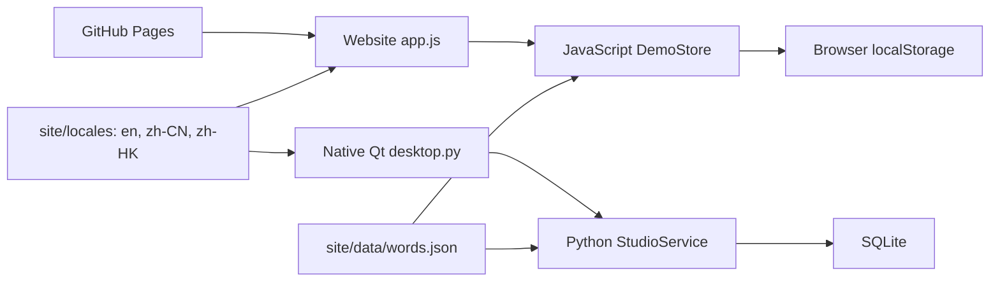
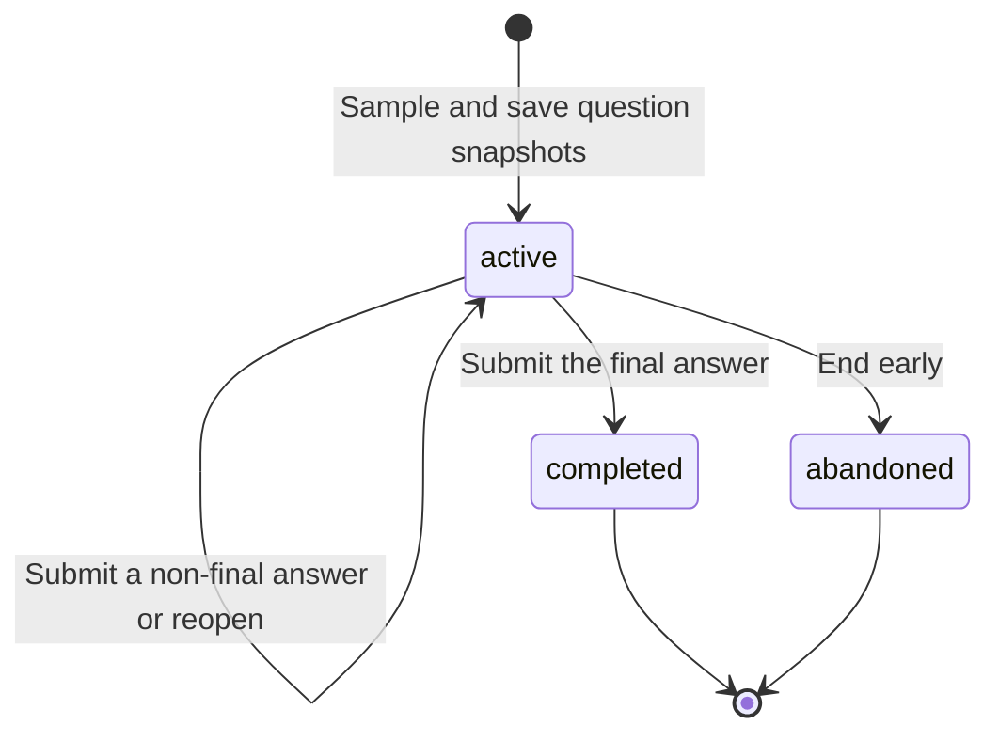

# Architecture

**English** | [简体中文](../zh-CN/architecture.md) | [繁体中文](../zh-HK/architecture.md)

## Components

The website and desktop share the initial vocabulary and equivalent business rules, implemented separately for their runtimes. Both load the same language catalogues. `site/` deploys independently and calls no Python API. The Python website launcher serves static resources; it does not grade or store browser results.

## Website

- `app.js`: rendering, navigation, forms, dialogs, exports, error feedback and cross-tab updates.
- `engine.js`: word validation, practice lifecycle, grading, mistake statistics and persistence.
- `i18n.js` and `locales/`: language selection, formatting, built-in topic and Chinese prompt display.
- `style.css`: responsive layout, focus states, tables, charts and dialogs.
- `ket-word-studio.demo.v1`: localStorage key for the schema version, words and practices. The role stays in memory and resets to Student on a new visit.
- `ket-word-studio.language`: a separate language preference. Existing learning data requires no migration for language switching.

Before a mutation, the store reads the latest data and works on a copy. Memory is updated only after storage succeeds. Blocked or full storage produces an error instead of claiming a save. There is no cross-tab transaction lock, so this is not a real multi-user teaching backend.

## Desktop

`desktop.py` uses native PySide6 widgets; `service.py` contains business rules; `storage.py` opens short-lived connections for operations. SQLite uses WAL, foreign keys and `BEGIN IMMEDIATE` write transactions. `i18n.py` reads the shared catalogues and stores the language in a separate `preferences.json` beside the database.

| Table | Purpose |
| --- | --- |
| metadata | Initialization marker |
| words | Unique English key, meaning, topic, aliases and enabled state |
| quizzes | Mode, topic, timestamps, state and sample marker |
| answers | Word snapshot, question index, submitted answer, grade and timestamp |

A partial unique index permits only one active practice. There are no account, password, session or login tables.

## Practice state

Retrying the same submitted answer returns the same result. Changing a submitted answer or submitting out of order is rejected. Statistics and the mistake list update only after completion. Snapshots keep historical questions independent of vocabulary changes. Language changes affect display, not stored question identity, answers or grades.

JavaScript uses Fisher–Yates shuffling and takes a slice; Python samples without replacement. Answers undergo Unicode NFKC normalization, case normalization and whitespace cleanup before comparison with the spelling and aliases. This is rule-based grading, not semantic understanding.

## Data and presentation boundaries

Any visitor can inspect the teacher view. The website does not collect student names, passwords or contact details, and does not upload browser results. Web input is escaped for text display; Qt labels use PlainText. CSV formula prefixes are escaped. CSV headings follow the selected language; JSON retains its stable schema.

The Pages workflow uploads only `site/`. Relative resource paths support repository subpaths. No third-party CDN, external font or API key is needed. User-created vocabulary is not sent to translation services.

## Documentation structure and validation

The English repository entry is `README.md`, with `README.zh-CN.md` and `README.zh-HK.md` alongside it. The five project documents live in `doc/en/`, `doc/zh-CN/` and `doc/zh-HK/`; badges and images are shared. Each document links directly to its other-language equivalents. Download guides and third-party notices also have all three versions. Licence copies retain their original wording.

JavaScript tests cover rules, storage failures, catalogue completeness, language preferences and exports. Python tests cover transactions, snapshots, resume and statistics. Qt tests interact with real widgets and switch language before and after grading. Browser checks cover actual navigation, forms, grading, language persistence and refresh. Isolated test data keeps personal records out of the repository.

[Back to README](../../README.md)
