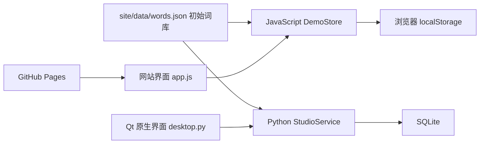
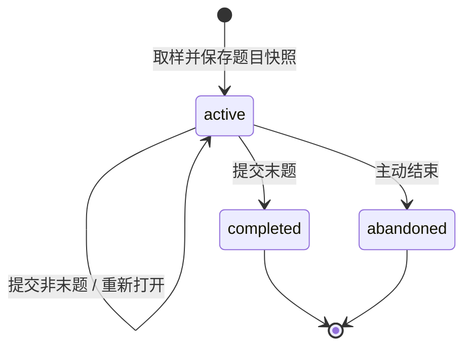

# 架构设计

[English](../en/architecture.md) | **简体中文** | [繁体中文](../zh-HK/architecture.md)

## 模块关系

网站与桌面共享初始词库和业务规则，两种运行环境分别实现逻辑。`site/` 可独立发布，不调用 Python API。Python 本地网站启动器只负责提供静态资源，不参与判分或保存浏览器记录。

## 网站

- `app.js`：页面渲染、导航、表单、对话框、导出下载、错误提示与跨标签页刷新。
- `engine.js`：词条验证、练习生命周期、答案判定、错词统计及持久化。
- `style.css`：响应式布局、焦点样式、表格、图表和模态窗口。
- localStorage 键 `ket-word-studio.demo.v1`：保存版本号、词库及练习数组。角色只保存在内存，每次重新访问默认进入学生页面。

修改前读取最新数据，复制状态后执行操作，存储成功才提交内存状态。浏览器拒绝写入或容量不足时显示明确错误，不宣称已保存。此方案没有跨标签页事务锁，不适合作为真实多用户教学平台。

## 桌面

`desktop.py` 使用 PySide6 原生组件；`service.py` 处理业务；`storage.py` 为每次操作创建短生命周期连接。SQLite 使用 WAL、外键约束与 `BEGIN IMMEDIATE` 写事务。

| 表 | 用途 |
| --- | --- |
| metadata | 初始化标记 |
| words | 唯一英文键、释义、主题、别名、启用状态 |
| quizzes | 模式、主题、开始 / 完成时间、状态、示例标记 |
| answers | 词条快照、题号、用户答案、正确标记、提交时间 |

部分唯一索引保证只有一次进行中的练习。没有账户、密码、会话或登录表。

## 练习状态

同题重复提交相同答案返回同一结果；修改已提交答案或跳序提交被拒绝。完成练习后才统计成绩和更新错词集合。词条快照使历史记录不受词库变更影响。

JavaScript 使用 Fisher–Yates 洗牌后截取；Python 使用不放回抽样。答案先进行 Unicode NFKC、大小写归一化和空白合并，再比较标准拼写与别名。该算法是规则判分，不是语义理解。

## 数据和展示边界

角色切换不是身份认证，任何访问者都可检查教师界面。网站不会收集学生姓名、密码或联系方式，也不会上传浏览器成绩。前端将输入转义为文本显示；Qt 标签使用 PlainText。CSV 对公式前缀进行转义。

GitHub Pages 工作流只上传 `site/`。所有资源采用相对地址，兼容仓库子路径。发布不依赖第三方 CDN、外部字体或 API 密钥。

## 验证策略

JavaScript 测试覆盖规则和存储错误；Python 测试覆盖事务、快照、续接、统计与导出；Qt 测试通过实际控件填写词条和作答；浏览器人工检查真实导航、表单、判分和刷新持久化。两端都使用隔离的测试数据，不附带个人记录。

## 多语言与目录组织

`site/i18n.js` 与 `ket_studio/i18n.py` 读取同一组 `site/locales/` 资源。语言代码为 `en`、`zh-CN`、`zh-HK`。网站使用独立的 `ket-word-studio.language` 保存偏好；Qt 在数据库旁保存 `preferences.json`。语言切换仅改变显示，不修改题目身份、答案或成绩；CSV 表头本地化，JSON 保留稳定字段。

默认英语入口为 `README.md`，根目录的 `README.zh-CN.md` 和 `README.zh-HK.md` 提供中文入口。五篇项目文档位于 `doc/en/`、`doc/zh-CN/`、`doc/zh-HK/`，共用徽章和截图。下载说明与第三方说明同样提供三语；许可证副本保留原文。

语言测试覆盖资源键和参数完整性、默认语言、偏好保存失败、数据隔离、CSV 以及 Qt 作答和判分中的语言切换。文档检查验证相对链接、语言入口和标题锚点。

[返回 README](../../README.zh-CN.md)
