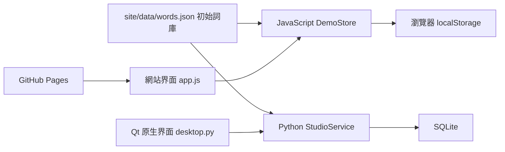
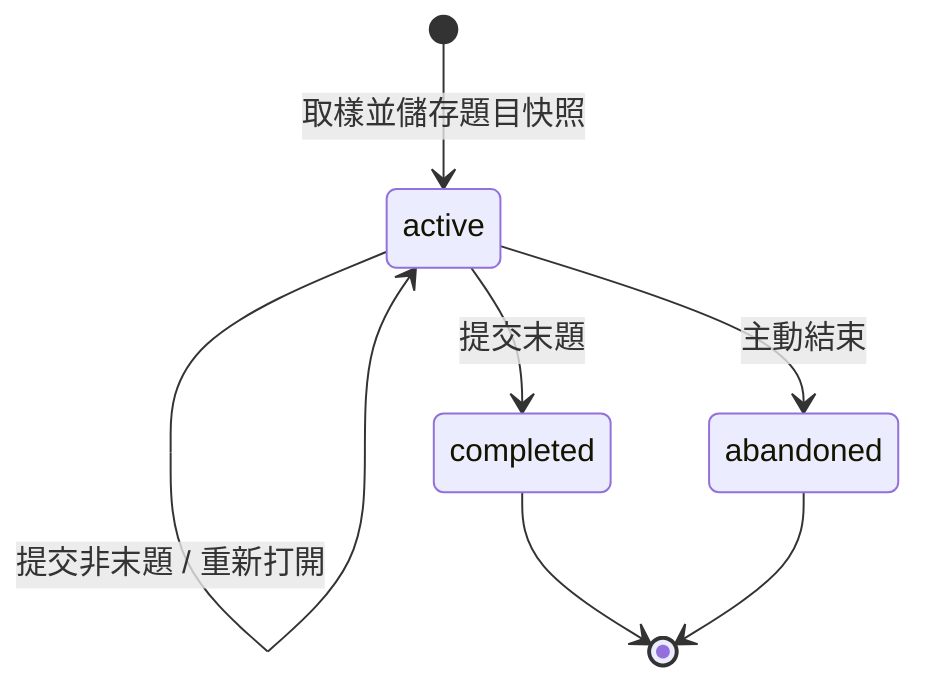

# 架構設計

[English](../en/architecture.md) | [简体中文](../zh-CN/architecture.md) | **繁体中文**

## 模塊關係

網站與桌面共享初始詞庫和業務規則，兩種運行環境分別實現邏輯。`site/` 可獨立發佈，不調用 Python API。Python 本地網站啓動器只負責提供靜態資源，不參與判分或儲存瀏覽器記錄。

## 網站

- `app.js`：頁面渲染、導航、表單、對話框、導出下載、錯誤提示與跨標籤頁刷新。
- `engine.js`：詞條驗證、練習生命週期、答案判定、錯詞統計及持久化。
- `style.css`：響應式佈局、焦點樣式、表格、圖表和模態窗口。
- localStorage 鍵 `ket-word-studio.demo.v1`：儲存版本號、詞庫及練習數組。角色只儲存在內存，每次重新訪問默認進入學生頁面。

修改前讀取最新數據，複製狀態後執行操作，存儲成功才提交內存狀態。瀏覽器拒絕寫入或容量不足時顯示明確錯誤，不宣稱已儲存。此方案沒有跨標籤頁事務鎖，不適合作為真實多用户教學平台。

## 桌面

`desktop.py` 使用 PySide6 原生組件；`service.py` 處理業務；`storage.py` 為每次操作創建短生命週期連接。SQLite 使用 WAL、外鍵約束與 `BEGIN IMMEDIATE` 寫事務。

| 表 | 用途 |
| --- | --- |
| metadata | 初始化標記 |
| words | 唯一英文鍵、釋義、主題、別名、啓用狀態 |
| quizzes | 模式、主題、開始 / 完成時間、狀態、示例標記 |
| answers | 詞條快照、題號、用户答案、正確標記、提交時間 |

部分唯一索引保證只有一次進行中的練習。沒有賬户、密碼、會話或登錄表。

## 練習狀態

同題重複提交相同答案返回同一結果；修改已提交答案或跳序提交被拒絕。完成練習後才統計成績和更新錯詞集合。詞條快照使歷史記錄不受詞庫變更影響。

JavaScript 使用 Fisher–Yates 洗牌後截取；Python 使用不放回抽樣。答案先進行 Unicode NFKC、大小寫歸一化和空白合併，再比較標準拼寫與別名。該算法是規則判分，不是語義理解。

## 數據和展示邊界

角色切換不是身份認證，任何訪問者都可檢查教師界面。網站不會收集學生姓名、密碼或聯繫方式，也不會上傳瀏覽器成績。前端將輸入轉義為文本顯示；Qt 標籤使用 PlainText。CSV 對公式前綴進行轉義。

GitHub Pages 工作流只上傳 `site/`。所有資源採用相對地址，兼容倉庫子路徑。發佈不依賴第三方 CDN、外部字體或 API 密鑰。

## 驗證策略

JavaScript 測試覆蓋規則和存儲錯誤；Python 測試覆蓋事務、快照、續接、統計與導出；Qt 測試通過實際控件填寫詞條和作答；瀏覽器人工檢查真實導航、表單、判分和刷新持久化。兩端都使用隔離的測試數據，不附帶個人記錄。

## 多語言與目錄組織

`site/i18n.js` 與 `ket_studio/i18n.py` 讀取同一組 `site/locales/` 資源。語言代碼為 `en`、`zh-CN`、`zh-HK`。網站使用獨立的 `ket-word-studio.language` 儲存偏好；Qt 在數據庫旁儲存 `preferences.json`。語言切換僅改變顯示，不修改題目身份、答案或成績；CSV 表頭本地化，JSON 保留穩定字段。

默認英語入口為 `README.md`，根目錄的 `README.zh-CN.md` 和 `README.zh-HK.md` 提供中文入口。五篇項目文檔位於 `doc/en/`、`doc/zh-CN/`、`doc/zh-HK/`，共用徽章和截圖。下載說明與第三方說明同樣提供三語；許可證副本保留原文。

語言測試覆蓋資源鍵和參數完整性、默認語言、偏好儲存失敗、數據隔離、CSV 以及 Qt 作答和判分中的語言切換。文檔檢查驗證相對鏈接、語言入口和標題錨點。

[返回 README](../../README.zh-HK.md)
